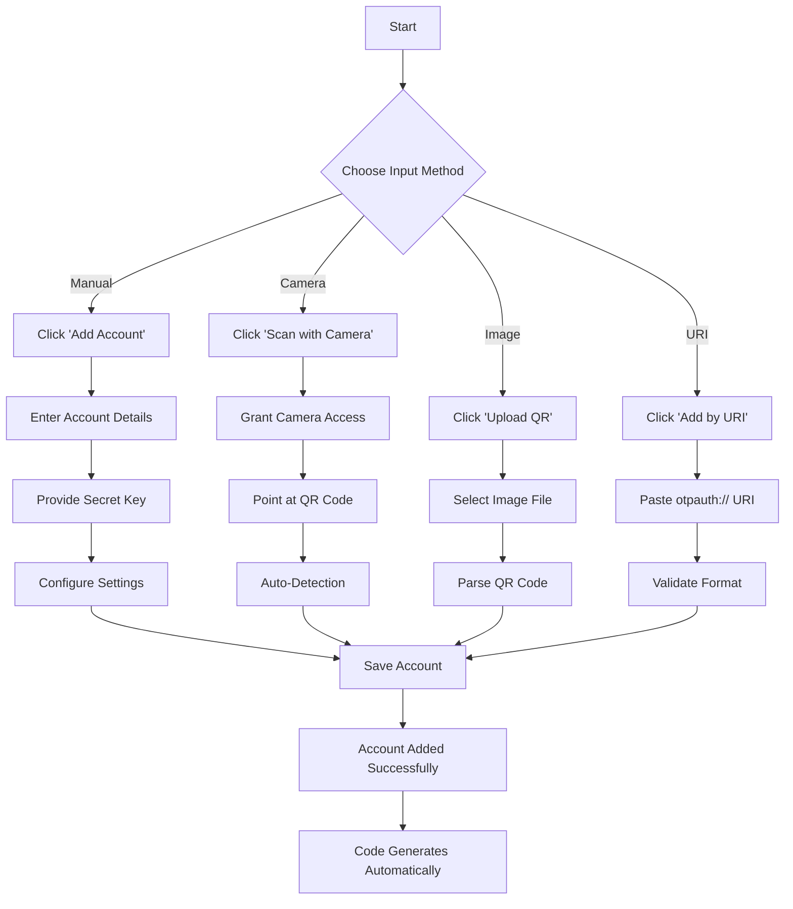
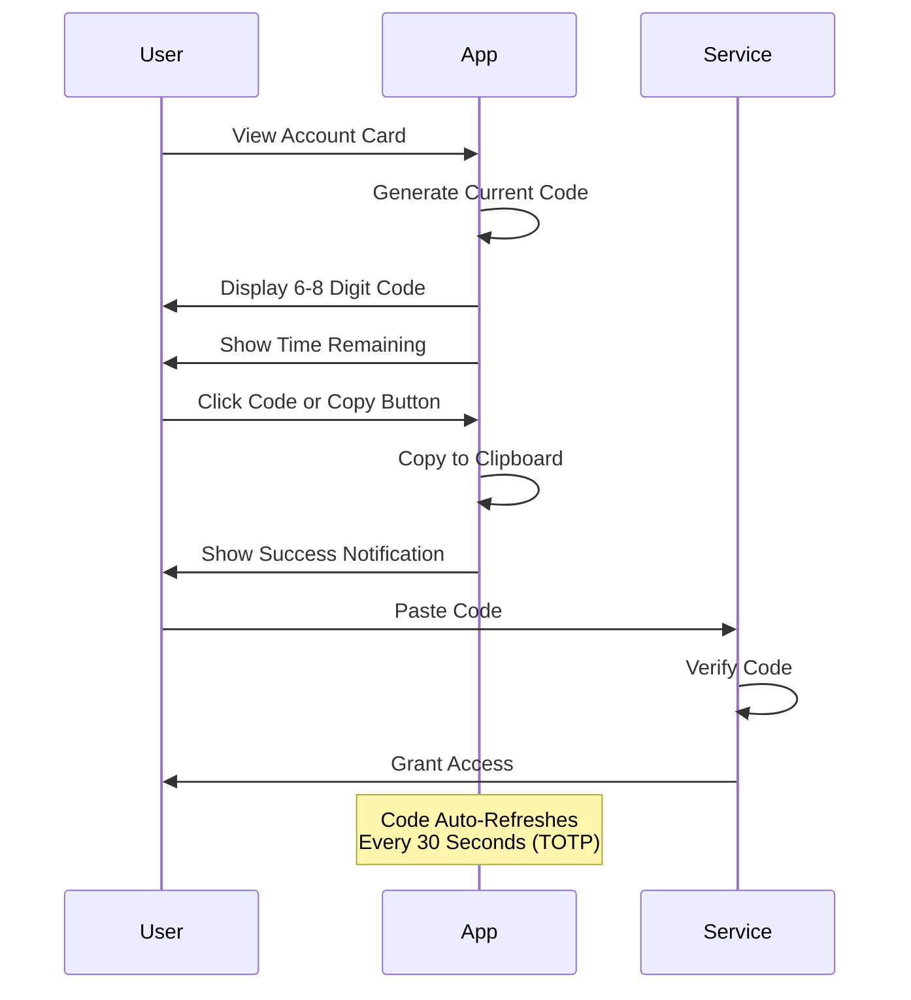
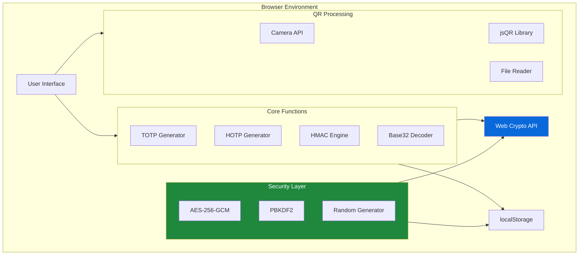

# xsukax Secure Authenticator

A privacy-focused, client-side two-factor authentication (2FA) application that generates Time-based One-Time Passwords (TOTP) and HMAC-based One-Time Passwords (HOTP) entirely within your browser. No server communication, no tracking, complete control over your authentication codes.

[](https://www.gnu.org/licenses/gpl-3.0)

## 🔐 Security and Privacy Benefits

xsukax Secure Authenticator is built with security and privacy as foundational principles:

### Client-Side Architecture
- **Zero Server Communication**: All cryptographic operations execute locally in your browser using the Web Crypto API
- **No Data Transmission**: Your secrets never leave your device—no analytics, no telemetry, no cloud synchronization
- **Offline Functionality**: Works completely offline after initial load, ensuring accessibility without internet dependency

### Robust Encryption
- **AES-256-GCM Encryption**: Industry-standard encryption for backup files protects your authentication secrets
- **PBKDF2 Key Derivation**: Password-based keys are derived using PBKDF2 with 100,000 iterations and SHA-256, providing strong resistance against brute-force attacks
- **Cryptographically Secure Random Generation**: All initialization vectors (IVs) and salts utilize `crypto.getRandomValues()` for unpredictable randomness

### Data Sovereignty
- **Local Storage Only**: Account data persists exclusively in your browser's localStorage—you maintain full ownership
- **Self-Contained Single File**: The entire application is contained in one HTML file with no external dependencies (except the open-source jsQR library for QR code scanning)
- **No Third-Party Services**: No authentication tokens, no API keys, no external service integrations

### Standards Compliance
- **RFC 6238 (TOTP)**: Full implementation of the Time-based One-Time Password algorithm
- **RFC 4226 (HOTP)**: Complete support for HMAC-based One-Time Password algorithm
- **Multiple Hash Algorithms**: Support for SHA-1, SHA-256, and SHA-512 to accommodate various service requirements

## ✨ Features and Advantages

### Comprehensive Account Management
- **Multiple Input Methods**: Add accounts via manual entry, camera QR scanning, image upload, or otpauth:// URI
- **Flexible Configuration**: Customize algorithm (SHA-1/SHA-256/SHA-512), digit count (6-8), and time period (15-60 seconds)
- **TOTP and HOTP Support**: Handle both time-based and counter-based one-time password generation

### User Experience
- **Real-Time Code Generation**: Codes update automatically with visual countdown timers
- **One-Click Copy**: Instantly copy codes to clipboard with a single click
- **Visual Progress Indicators**: Color-coded progress bars (green/yellow/red) indicate code expiration timing
- **Responsive Design**: Optimized interface adapts seamlessly to desktop, tablet, and mobile devices
- **Clean GitHub-Inspired UI**: Professional, minimalist design language for clarity and focus

### Data Portability
- **Encrypted Export**: Backup all accounts to an encrypted JSON file protected by your chosen password
- **Secure Import**: Restore accounts from encrypted backup files with password verification
- **Cross-Device Transfer**: Move your authentication database between devices securely

### Technical Capabilities
- **Camera Integration**: Direct QR code scanning through device camera with automatic detection
- **Multi-Camera Support**: Switch between front and rear cameras on supported devices
- **Image Processing**: Upload and parse QR code images for offline account setup
- **Format Validation**: Automatic validation of secret keys, URIs, and configuration parameters

## 📥 Installation Instructions

xsukax Secure Authenticator requires no installation in the traditional sense. Follow these simple steps:

### Method 1: Direct Download
1. Download the `index.html` file from this repository
2. Save it to a location on your computer
3. Open the file in any modern web browser (Chrome, Firefox, Safari, Edge)

### Method 2: Clone Repository
```bash
git clone https://github.com/xsukax/xsukax-Secure-Authenticator.git
cd xsukax-Secure-Authenticator
```
Then open `index.html` in your preferred browser.

### Method 3: GitHub Pages (Coming Soon)
Access the live application directly at: `https://xsukax.github.io/xsukax-Secure-Authenticator`

### System Requirements
- Modern web browser with:
  - JavaScript enabled
  - Web Crypto API support (all modern browsers)
  - localStorage enabled
  - Camera access (optional, for QR scanning)

## 📖 Usage Guide

### Adding Your First Account



### Manual Account Addition

1. **Click "Add Account"** button in the toolbar
2. **Fill in the form**:
   - **Account Name**: Your identifier (e.g., email address or username)
   - **Issuer**: Service name (e.g., Google, GitHub, AWS)
   - **Secret Key**: The base32-encoded secret provided by the service
   - **Type**: Select TOTP (time-based) or HOTP (counter-based)
   - **Algorithm**: Choose SHA-1, SHA-256, or SHA-512
   - **Digits**: Select code length (typically 6)
   - **Period**: For TOTP, set the refresh interval in seconds (typically 30)
3. **Click "Add Account"** to save

### QR Code Scanning

#### Via Camera
1. Click **"Scan with Camera"**
2. Grant camera permissions when prompted
3. Position the QR code within the green overlay
4. The account is automatically added upon successful detection
5. Use **"Switch Camera"** if multiple cameras are available

#### Via Image Upload
1. Click **"Upload QR"**
2. Select a QR code image from your device
3. Preview the image to verify
4. Click **"Add Account"** to process and save

### URI Import
1. Click **"Add by URI"**
2. Paste the complete `otpauth://` URI (example: `otpauth://totp/GitHub:user@email.com?secret=JBSWY3DPEHPK3PXP&issuer=GitHub`)
3. Click **"Add Account"** to parse and save

### Using Your Codes



Each account displays:
- **Large Code Display**: Current 6-8 digit authentication code
- **Progress Bar**: Visual countdown until code expires (TOTP only)
- **Time Remaining**: Exact seconds until next code generation
- **Copy Button**: One-click clipboard copy functionality
- **Account Metadata**: Type (TOTP/HOTP), algorithm, and digit count

### Backup and Restore

#### Creating Encrypted Backup


1. Click **"Export"** in the toolbar
2. Enter a **strong password** (minimum 8 characters)
3. Confirm the password
4. Click **"Export Backup"**
5. Save the generated JSON file securely (encrypted with AES-256)

⚠️ **Important**: Store your password securely—it cannot be recovered if lost.

#### Restoring from Backup
1. Click **"Import"** in the toolbar
2. Select your encrypted backup JSON file
3. Enter the decryption password
4. Click **"Import Backup"**
5. All accounts are restored and overwrite current data

### Managing Accounts

- **Copy Code**: Click the code display or the "Copy Code" button
- **Delete Account**: Click the "Delete Account" button and confirm
- **Next Code (HOTP)**: Click "Next Code" to increment the counter and generate the next code

### Architecture Overview



## 🔧 Technical Specifications

### Cryptographic Implementation
- **TOTP**: RFC 6238 compliant with configurable period (15-60s)
- **HOTP**: RFC 4226 compliant with counter management
- **HMAC**: SHA-1, SHA-256, and SHA-512 support
- **Key Derivation**: PBKDF2 with 100,000 iterations
- **Encryption**: AES-256-GCM with random IV and salt

### Browser Compatibility
- Chrome/Edge 88+
- Firefox 85+
- Safari 14+
- Opera 74+

### Dependencies
- **jsQR** (v1.4.0): QR code parsing library loaded from CDN
- **Font Awesome** (v6.4.0): Icon library loaded from CDN

## 🤝 Contributing

Contributions are welcome! Please feel free to submit pull requests, report bugs, or suggest features through the GitHub issue tracker.

### Development Guidelines
1. Maintain the zero-dependency, single-file architecture
2. Ensure all cryptographic operations use Web Crypto API
3. Follow existing code style and formatting
4. Test thoroughly across multiple browsers
5. Document all new features comprehensively

## 📄 License

This project is licensed under the GNU General Public License v3.0.

## ⚠️ Security Considerations

- **Browser Security**: Your data is only as secure as your browser and operating system
- **Password Strength**: Use strong, unique passwords for encrypted backups
- **Device Security**: Keep your device secure with screen locks and encryption
- **Backup Storage**: Store encrypted backup files in secure locations
- **Trust**: Only use this application from the official GitHub repository

## 🆘 Support

For issues, questions, or feature requests, please use the [GitHub Issues](https://github.com/xsukax/xsukax-Secure-Authenticator/issues) page.

## 🙏 Acknowledgments

- Built with modern web standards and the Web Crypto API
- QR code scanning powered by [jsQR](https://github.com/cozmo/jsQR)
- UI design inspired by GitHub's design system

---

**Made with ❤️ for privacy and security**
